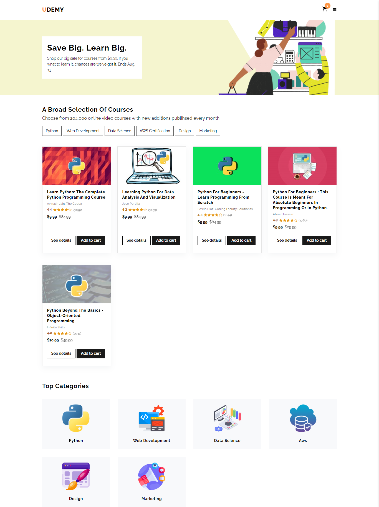

# Udemy Clone - E-Commerce App Link :

https://656a07fadb89ad0d9b415f84--celadon-caramel-f38369.netlify.app/

# tools :

- html  
- styled-component   
- react.js  
- react hooks  
- react icons 
- local storage 
- context api  

# features

- Udemy clone E-commerce App with an impressive shopping cart UI using React JS. 
- user can navigate the different pages to see the courses.  
- There are two fixed components in all content of website [navbar and sidebar]  
- there are four pages  
- home page 
- courses page 
- category page 
- cart page 
